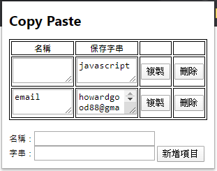

# Copy-Paste
A Chrome extension for storing and copying text.  

## 安裝
※目前只在Chrome上測試過
1. 點選Chrome右上角3個點點的按鈕 > 更多工具 > 擴充功能
1. 點擊左上角「載入未封裝項目」
1. 選擇此專案資料夾
1. Copy Paste的招牌藍色笑容即出現於Chome左上角擴充功能區

## 功能
* **字串欄位**可輸入欲保存之字串
* 輸入後按**新增項目**即可保存字串
* **複製**按鈕可複製該欄字串
* **刪除**按鈕可刪除該行紀錄

## 待開發功能
* 拖動調整順序 	(實作有點麻煩，目前以可隨時修改的textarea代替)
* 群組管理		(想實現的效果同為拖動，故需先實作出前者)
